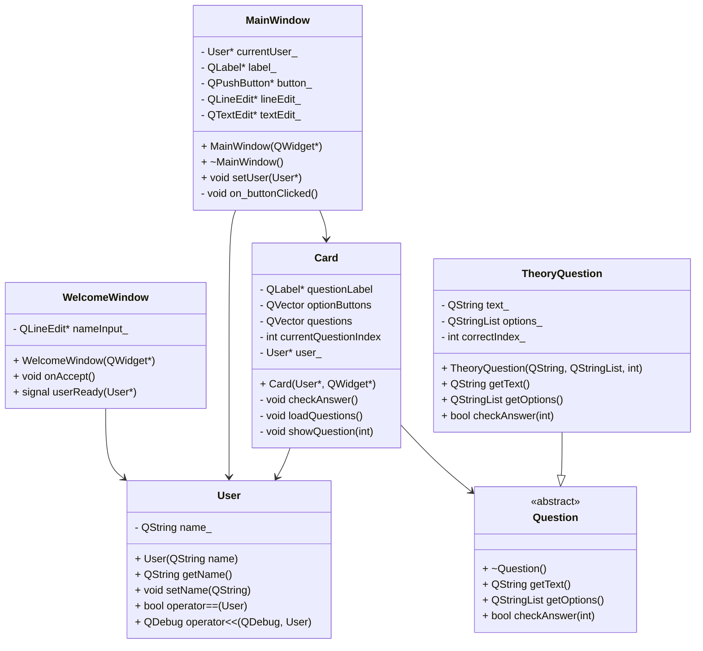

# 📚 Memoboots

**Memoboots** es una aplicación educativa dinámica diseñada para ayudarte a aprender y recordar información de manera efectiva a través de tarjetas de estudio y quizzes diseñados con los recursos de aprendizaje que exploraste en las tarjetas. 💡

---

## 🌟 Visión

Revolucionar la forma en que los estudiantes aprenden, memorizan y acceden al conocimiento, combinando el poder del repaso espaciado (algoritmo SM-2), la gamificación y el acceso a recursos externos confiables. Queremos convertir cada sesión de estudio en una experiencia divertida, sencilla y enriquecedora. 🚀

---

## ❗ Problema que resuelve

Muchos estudiantes enfrentan dificultades para retener información a largo plazo y carecen de herramientas eficientes para organizar su estudio. Además:

- Las plataformas tradicionales no integran **Recursos de aprendizaje atractivos**.
- Existe una **saturación de recursos no confiables** o dispersos en línea.
- Los usuarios no tienen retroalimentación inmediata en su proceso de aprendizaje.

**Memoboots** resuelve esto con un sistema completo que integra tarjetas atractivas, quizzes y enlaces a contenido educativo validado. 🧠✅

---

## 🎯 Usuarios Objetivo

- 🧑‍🎓 Estudiantes de secundaria, preparatoria y universidad que buscan mejorar su memoria y rendimiento académico.
- 👩‍🏫 Profesores y tutores que deseen complementar sus clases con herramientas didácticas digitales.
- 👨‍💻 Aprendices autodidactas interesados en temas técnicos, científicos o de preparación para exámenes.

---

📖 ¡Comienza a aprender como nunca antes con **Memoboots**! 🌱📈

## 🧠 Diagrama de Clases UML

